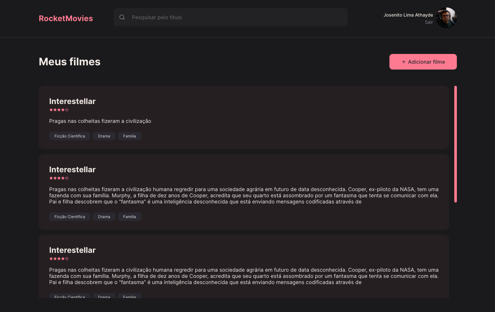

# Space Cream

This project aims to demonstrate skills in REACT.JS and STYLED-COMPONENTS, creating a web page with a nice and intuitive layout.

The project is part of the course Explorer Rocketseat



## Technologies Used

- VITE
- REACT.JS
- REACT-ICONS
- REACT-ROUTER-DOM
- STYLED-COMPONENTS

## How to run the project

To execute the project, just clone this repository to your local machine.

```bash
git clone https://github.com/josenito/rocketmovies.git
cd rocketmovies
npm install 
```

## Author

Josenito Lima Athayde.

[](https://www.linkedin.com/in/josenito-lima-athayde-277a8ab3/)

[](https://github.com/josenito)

## License

This project is licensed under the MIT license 

[](https://choosealicense.com/licenses/mit/) 